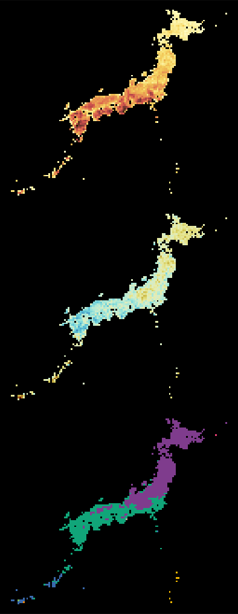

```{r setup, include=FALSE}
knitr::opts_chunk$set(echo = FALSE, warning = FALSE, message = FALSE, include = TRUE, eval = TRUE, cache = TRUE, dev = "svg")
```

```{r load-packages, cache = FALSE}
library(conflicted)
library(magick)
library(ggtext)
library(drake)
library(knitr)
library(patchwork)
library(scales)
library(scico)
library(magrittr)
library(broom)
library(assertr)
library(sf)
library(rcartocolor)
library(tidyverse)

# Resolve conflicts
conflicted::conflict_prefer("map", "purrr")
conflicted::conflict_prefer("select", "dplyr")
conflicted::conflict_prefer("filter", "dplyr")
conflicted::conflict_prefer("gather", "tidyr")
conflicted::conflict_prefer("extract", "magrittr")

# Specify custom themes
simple_map_theme <- function () {
  theme(
    panel.grid.major = element_line(color = "white", size = 0.1),
    panel.background = element_rect(fill = "grey70"),
    legend.position = "none",
    axis.text = element_blank(),
    axis.ticks = element_blank()
  )
}

trend_line_theme <- function () {
  theme(
    panel.background = element_blank(),
    panel.grid.major = element_line(size = 0.1, color = "dark grey"),
    panel.grid.minor = element_blank(),
    axis.title.y = element_blank(),
    axis.ticks.y = element_blank(),
    axis.ticks.x = element_blank(),
    axis.text.y = element_blank()
  )
}


map_theme_pp <- function() {
  theme(
    panel.grid.major = element_line(color = "white", size = 0.1),
    panel.background = element_rect(fill = "grey70"),
    axis.ticks = element_blank()
  )
}

map_theme_pp_light <- function() {
  theme(
    panel.grid.major = element_line(color = "white", size = 0.1),
    panel.background = element_rect(fill = "grey90"),
    axis.ticks = element_blank()
  )
}

source(here::here("R/functions.R"))
```

```{r load-data, cache = FALSE}
# Set cache
ja_fern_cache <- new_cache(here::here("ja_fern_cache"))

# Load targets
loadd(list = c(
  "traits_for_dist",
  "ses_div_ferns_spatial",
  "occ_point_data_ferns",
  "protected_areas"),
  cache = ja_fern_cache)

# Change phyloregion cluster to factor
ses_div_ferns_spatial <- ses_div_ferns_spatial %>%
  mutate(taxonomic_cluster = as.factor(taxonomic_cluster) %>% fct_infreq %>% as.numeric %>% as.factor) %>%
  mutate(phylo_cluster = as.factor(phylo_cluster) %>% fct_infreq %>% as.numeric %>% as.factor)

# Read in pteridophyte GBIF collections per country data from
# Iwasaki lab presentation
collections_by_country <- read_csv(here::here("data_raw/gbif_pterido_coll_by_country.csv")) %>%
  mutate(country = factor(country)) %>%
  mutate(country = fct_reorder(country, n))

# Download high-res map of Japan,
# crop to spatial div results area
japan <- rnaturalearth::ne_countries(country = "japan", scale = "large", returnclass = "sf") %>%
  sf::st_crop(sf::st_bbox(ses_div_ferns_spatial))

# Save currently used data as back-up in case data produced by plan changes
data <- list(
  ses_div_ferns_spatial = ses_div_ferns_spatial,
  occ_point_data_ferns = occ_point_data_ferns,
  collections_by_country = collections_by_country,
  japan = japan
)

saveRDS(data, here::here("presentations/bsa_2020-07-27/data/data.RDS"))
```

```{r title-slide-image, eval = FALSE}
# Code to make title slide image, don't need to run when rendering slides
title_theme <- theme_void() +
  theme(
    plot.title = element_blank(),
    plot.subtitle = element_blank(),
    legend.position = "none",
     panel.background = element_rect(fill = "black"),
    panel.grid.major = element_blank(),
    panel.grid.minor = element_blank(),
  )

# Change cluster to factor
ses_div_ferns_spatial <- ses_div_ferns_spatial %>%
  mutate(taxonomic_cluster = as.factor(taxonomic_cluster) %>% fct_infreq %>% as.numeric %>% as.factor) %>%
  mutate(phylo_cluster = as.factor(phylo_cluster) %>% fct_infreq %>% as.numeric %>% as.factor)


a <- ggplot(ses_div_ferns_spatial, aes(fill = richness)) +
  geom_sf(color = "transparent") +
  scale_fill_scico(palette = "lajolla") +
  title_theme

b <- ggplot(ses_div_ferns_spatial, aes(fill = rpd_obs_z)) +
  geom_sf(color = "transparent") +
  labs(fill = "SES RPD") +
  scale_fill_scico(
    palette = "roma",
    na.value="grey80",
    direction = -1,
    limits = c(
      -get_limit(ses_div_ferns_spatial, rpd_obs_z, "abs"),
      get_limit(ses_div_ferns_spatial, rpd_obs_z, "abs")
    )) +
  title_theme

c <- ggplot(ses_div_ferns_spatial, aes(fill = phylo_cluster)) +
  geom_sf(color = "transparent") +
  labs(fill = "Cluster") +
  scale_fill_carto_d(name = "Cluster", type = "qualitative", palette = "Bold") +
  title_theme

a + b + c + plot_layout(ncol = 1)

# Write out here, then crop manually
ggsave(
  plot = title_image, 
  filename = here::here("presentations/bsa_2020-07-27/images/title.png"),
  dpi = 300)
```

class: inverse, middle, title-slide, big-margin
background-color: #000000
background-position: 50% 50%
background-image: url(images/title_background.png)
background-size: contain

.pull-left-wide[
# Exploring dimensions of biodiversity in Japanese ferns
<br>
## Joel H. Nitta<sup>1</sup>, Atsushi Ebihara<sup>2</sup>

<sup>1</sup>University of Tokyo<br>
<span style = 'font-size: 80%;'>https://joelnitta.com</span>

<sup>2</sup>National Museum of Nature and Science, Japan

Botanical Society of America<br><span style = 'font-size: 80%;'>2020.07.27</span>
]

.pull-right-narrow[

]

---
class: big-margin

## Biodiversity is a two-sided coin

Characterizing the **distribution of biodiversity** is needed to:

- understand the **processes** generating it

- understand how to **conserve** it

---
class: big-margin

## Most studies of biodiversity count species

However, taxonomic richness is only one dimension of biodiversity!

We should also consider

- Phylogenetic diversity

- Functional diversity

- How these are related to each other

This requires comprehensive sampling of taxa, DNA, and traits

---
class: big-margin

## Ferns of Japan

.pull-left[

- One of the best-collected fern floras in the world

- Extensive study by both scientists and amateur societies

]

.pull-right[
```{r gbif-colls-per-country}
# Plot showing top 10 pteridophyte collections in GBIF by country
ggplot(collections_by_country, aes(x = country, y = n)) +
  geom_col() +
  coord_flip() +
  labs(
    title = "GBIF pteridophyte \ncollections (top 10)",
    y = "No. collections") +
  scale_y_continuous(labels = scales::comma) +
  ggplot2::theme_bw(base_size = 24) +
  theme(
    axis.title.y = element_blank(),
    panel.grid.minor = ggplot2::element_blank(),
    panel.grid.major.y = ggplot2::element_blank(),
      axis.text.x = ggplot2::element_text(colour="black"),
      axis.text.y = ggplot2::element_text(colour="black")
  )
```
]

---
class: big-margin

## Ferns of Japan

.pull-left[
- One of the best-collected fern floras in the world

- Extensive study by both scientists and amateur societies
]

.pull-right[
```{r ja-pterido-coll-curve}
# Format fern abundances (no hybrids) as numeric vector
fern_abun <-
  occ_point_data_ferns %>%
  group_by(taxon) %>%
  count(sort = TRUE) %>%
  pull(n)

# Run iNEXT
inext_out <- iNEXT::iNEXT(fern_abun, q=0, datatype="abundance")

# create subset of observed points to add to plot as dots
observed_data <- inext_out$iNextEst[inext_out$iNextEst$method == "observed",]

# check estimated completeness
est_completeness <- inext_out$iNextEst %>% filter(method == "observed") %>% pull(SC) %>% scales::percent()
rich_interval <- glue::glue("{observed_data$qD.LCL %>% round} to {observed_data$qD.UCL %>% round}")
completeness_interval <- glue::glue("{observed_data$SC.LCL %>% scales::percent()} to {observed_data$SC.UCL %>% scales::percent()}")

# Make iNEXT plot
inext_out$iNextEst %>%
  filter(method != "observed") %>%
  ggplot(aes(x=m, y=qD)) +
  geom_ribbon(aes(ymin = qD.LCL, ymax = qD.UCL), fill = "grey70") +
  geom_line(aes(linetype=method), size=0.8) +
  scale_linetype_manual(values=c("dotted", "solid", "solid")) +
  geom_point(data=observed_data, size=3) +
  scale_y_continuous("Richness") +
  scale_x_continuous("No. specimens") +
  labs(
    title = "Species collection curve",
    subtitle = "Japanese ferns (no hybrids)"
  ) +
  ggplot2::theme_bw(base_size = 24) +
  theme(
    panel.grid.minor = ggplot2::element_blank(),
    axis.text.x = ggplot2::element_text(colour="black"),
    axis.text.y = ggplot2::element_text(colour="black"),
    legend.position="bottom", 
    legend.title=element_blank()
    )

```
]

---
class: big-margin

## Goals of this study

Using the **ferns of Japan** as a study system, seek to understand:

1. How is biodiversity distributed? 
 
2. How is biodiversity structured? 
 
3. How well is biodiversity protected?

---
## Species richness is humped-shaped

```{r lat-bins}
# Bin SES diversity results by latitudinal band (0.2 degree width)
ses_div_binned <-
  ses_div_ferns_spatial %>%
  mutate(
    longitude = sf::st_centroid(geometry) %>% st_coordinates %>% magrittr::extract(,1),
    latitude = sf::st_centroid(geometry) %>% st_coordinates %>% magrittr::extract(,2)) %>%
  as_tibble %>%
  dplyr::select(-geometry) %>%
  mutate(
    latitude = cut_width(latitude, width = 0.2, closed = "left") %>%
      str_split(",") %>%
      map_chr(1) %>%
      parse_number) %>%
  group_by(latitude) %>%
  summarize(
    across(c(richness, pe_obs_rank, contains("obs_z")), ~mean(.x, na.rm = TRUE))
  )

# Get min and max latitude for setting common limits between
# maps and trendlines
ja_lat_min <- ses_div_binned %>% pull(latitude) %>% min()
ja_lat_max <- ses_div_binned %>% pull(latitude) %>% max()
```

```{r richness, out.width = "120%"}
# Fern richness
# - map
a <- ggplot(ses_div_ferns_spatial, aes(fill = richness)) +
  geom_sf(color = "transparent") +
  scale_fill_scico(palette = "lajolla") + 
  labs(fill = "No. taxa") +
  scale_y_continuous(labels = scales::label_number(suffix = "\u00b0N", accuracy = 1)) +
  scale_x_continuous(labels = scales::label_number(suffix = "\u00b0E", accuracy = 1)) +
  map_theme_pp() +
  theme(
    legend.title = element_text(size = 20/.pt),
    legend.text = element_text(size = 16/.pt),
    legend.justification=c(0,1), legend.position=c(0,1)
  ) +
  ylim(ja_lat_min, ja_lat_max)

# - line tracking mean richness
b <-
  ggplot(ses_div_binned, aes(y = latitude, x = richness)) +
  geom_path() +
  labs(
    x = "No. taxa"
  ) +
  theme(
    panel.background = element_blank(),
    panel.grid.major = element_line(size = 0.1, color = "dark grey"),
    panel.grid.minor = element_blank(),
    axis.title.y = element_blank(),
    axis.ticks.y = element_blank(),
    axis.ticks.x = element_blank(),
    axis.text.y = element_blank()
  ) +
  ylim(ja_lat_min, ja_lat_max)

a + b + plot_layout(widths = c(3,1), heights = c(1,1))
```

---
## Other raw values are correlated with richness

```{r raw-div, out.width = "120%", fig.asp = 0.7}
# Richness
a <- ggplot(ses_div_ferns_spatial, aes(fill = richness)) +
  geom_sf(color = "transparent") +
  scale_fill_scico(palette = "lajolla") + 
  labs(title = "Taxonomic richness") +
  simple_map_theme()

b <- ggplot(ses_div_ferns_spatial, aes(fill = pd_obs)) +
  geom_sf(color = "transparent") +
  scale_fill_scico(palette = "lajolla") + 
  labs(title = "Phylogenetic diversity") +
  simple_map_theme()

c <- ggplot(ses_div_ferns_spatial, aes(fill = fd_obs)) +
  geom_sf(color = "transparent") +
  scale_fill_scico(palette = "lajolla") + 
  labs(title = "Functional diversity") +
  simple_map_theme()

d <- ggplot(ses_div_ferns_spatial, aes(x = richness, y = pd_obs)) +
  geom_point(shape = 1) +
  # Fit a logarithmic general additive model
  # https://stackoverflow.com/questions/40711980/r-ggplot2-fit-curve-to-scatter-plot
  geom_smooth(se = FALSE, method = "gam", formula = y ~ s(log(x)), size = 0.5) +
  labs(
    x = "No. taxa",
    y = "PD"
  ) +
  jntools::standard_theme()

e <- ggplot(ses_div_ferns_spatial, aes(x = richness, y = fd_obs)) +
  geom_point(shape = 1) +
  geom_smooth(se = FALSE, method = "gam", formula = y ~ s(log(x)), size = 0.5) +
  labs(
    x = "No. taxa",
    y = "FD"
  ) +
  jntools::standard_theme()

a + b + c +
  grid::textGrob("...as expected") + d + e +
  plot_layout(nrow = 2, heights = c(0.5, 0.5))
```

---
## Compare raw values to random expectation with <u>**S**</u>tandard <u>**E**</u>ffect <u>**S**</u>ize

.pull-left[
$SES = \frac{x - mean(x)}{sd(x)}$
]

.pull-right[
```{r ses-example}
null <- tibble(value = rnorm(10000))

obs_1 <- 0.95
obs_2 <- 0.5
obs_3 <- 0.05

ggplot(null, aes(x = value)) +
  geom_histogram(bins = 50) +
  geom_vline(xintercept = 0)
```
]

---
## Compare raw values to random expectation with <u>**S**</u>tandard <u>**E**</u>ffect <u>**S**</u>ize

PD is mostly clustered throughout

```{r ses-pd, out.width = "120%"}
# SES PD
# - map
a <- ggplot(ses_div_ferns_spatial, aes(fill = pd_obs_z)) +
  geom_sf(color = "transparent") +
  labs(fill = "SES PD") +
  scale_fill_scico(
    palette = "romaO",
    na.value="grey80",
    direction = -1,
    limits = c(
      -get_limit(ses_div_ferns_spatial, pd_obs_z, "abs"),
      get_limit(ses_div_ferns_spatial, pd_obs_z, "abs")
    )) +
  scale_y_continuous(labels = scales::label_number(suffix = "\u00b0N", accuracy = 1)) +
  scale_x_continuous(labels = scales::label_number(suffix = "\u00b0E", accuracy = 1)) +
  map_theme_pp() +
  theme(
    legend.title = element_text(size = 20/.pt),
    legend.text = element_text(size = 16/.pt),
    legend.justification=c(0,1), legend.position=c(0,1)
  )

# - line tracking mean SES RPD
b <-
  ggplot(ses_div_binned, aes(y = latitude, x = pd_obs_z)) +
  geom_path() +
  geom_vline(xintercept = 0, linetype="dashed") +
  labs(
    x = "SES PD"
  ) +
  ylim(24, 46) +
  theme(
    panel.background = element_blank(),
    panel.grid.major = element_line(size = 0.1, color = "dark grey"),
    panel.grid.minor = element_blank(),
    axis.title.y = element_blank(),
    axis.ticks.y = element_blank(),
    axis.ticks.x = element_blank(),
    axis.text.y = element_blank()
  )

a + b + plot_layout(widths = c(3,1), heights = c(1,1))
```

---
## Compare branch lengths with <u>**R**</u>elative <u>**P**</u>hylogenetic <u>**D**</u>iversity

RPD = original branch lengths / all branch lengths equal

---
## Compare branch lengths with <u>**R**</u>elative <u>**P**</u>hylogenetic <u>**D**</u>iversity

RPD is high in the N and S

```{r ses-rpd, out.width = "120%"}
# SES RPD
# - map
a <- ggplot(ses_div_ferns_spatial, aes(fill = rpd_obs_z)) +
  geom_sf(color = "transparent") +
  labs(fill = "SES RPD") +
  scale_fill_scico(
    palette = "romaO",
    na.value="grey80",
    direction = -1,
    limits = c(
      -get_limit(ses_div_ferns_spatial, rpd_obs_z, "abs"),
      get_limit(ses_div_ferns_spatial, rpd_obs_z, "abs")
    )) +
  scale_y_continuous(labels = scales::label_number(suffix = "\u00b0N", accuracy = 1)) +
  scale_x_continuous(labels = scales::label_number(suffix = "\u00b0E", accuracy = 1)) +
  map_theme_pp() +
  theme(
    legend.title = element_text(size = 20/.pt),
    legend.text = element_text(size = 16/.pt),
    legend.justification=c(0,1), legend.position=c(0,1)
  )

# - line tracking mean SES RPD
b <-
  ggplot(ses_div_binned, aes(y = latitude, x = rpd_obs_z)) +
  geom_path() +
  geom_vline(xintercept = 0, linetype="dashed") +
  labs(
    x = "SES RPD"
  ) +
  ylim(24, 46) +
  theme(
    panel.background = element_blank(),
    panel.grid.major = element_line(size = 0.1, color = "dark grey"),
    panel.grid.minor = element_blank(),
    axis.title.y = element_blank(),
    axis.ticks.y = element_blank(),
    axis.ticks.x = element_blank(),
    axis.text.y = element_blank()
  )

a + b + plot_layout(widths = c(3,1), heights = c(1,1))
```

---
## <u>**R**</u>elative <u>**F**</u>unctional <u>**D**</u>iversity: functional analog of RPD

RFD also high in the south

```{r ses-rpd-rfd, out.width = "120%"}
# SES RPD
# - map
a <- ggplot(ses_div_ferns_spatial, aes(fill = rfd_obs_z)) +
  geom_sf(color = "transparent") +
  labs(fill = "SES RFD") +
  scale_fill_scico(
    palette = "romaO",
    na.value="grey80",
    direction = -1,
    limits = c(
      -get_limit(ses_div_ferns_spatial, rfd_obs_z, "abs"),
      get_limit(ses_div_ferns_spatial, rfd_obs_z, "abs")
    )) +
  scale_y_continuous(labels = scales::label_number(suffix = "\u00b0N", accuracy = 1)) +
  scale_x_continuous(labels = scales::label_number(suffix = "\u00b0E", accuracy = 1)) +
  map_theme_pp() +
  theme(
    legend.title = element_text(size = 20/.pt),
    legend.text = element_text(size = 16/.pt),
    legend.justification=c(0,1), legend.position=c(0,1)
  )

# - line tracking mean SES RPD
b <-
  ggplot(ses_div_binned, aes(y = latitude, x = rfd_obs_z)) +
  geom_path() +
  geom_vline(xintercept = 0, linetype="dashed") +
  labs(
    x = "SES RFD"
  ) +
  ylim(24, 46) +
  theme(
    panel.background = element_blank(),
    panel.grid.major = element_line(size = 0.1, color = "dark grey"),
    panel.grid.minor = element_blank(),
    axis.title.y = element_blank(),
    axis.ticks.y = element_blank(),
    axis.ticks.x = element_blank(),
    axis.text.y = element_blank(),
    plot.margin = margin(l = -1, unit = "inch")
  )

a + b + plot_layout(widths = c(3,1), heights = c(1,1))
```

---
## Phylogenetic endemism: PD weighted by range size

Southern islands are hotspots of endemism

```{r pe, out.width = "120%"}
# PE
# - map
a <- ggplot(ses_div_ferns_spatial, aes(fill = pe_obs_rank)) +
  geom_sf(color = "transparent") +
  scale_fill_scico(palette = "lajolla") + 
  labs(fill = "PE Rank") +
  scale_y_continuous(labels = scales::label_number(suffix = "\u00b0N", accuracy = 1)) +
  scale_x_continuous(labels = scales::label_number(suffix = "\u00b0E", accuracy = 1)) +
  ylim(ja_lat_min, ja_lat_max) +
  map_theme_pp() +
  theme(
    legend.title = element_text(size = 20/.pt),
    legend.text = element_text(size = 16/.pt),
    legend.justification=c(0,1), legend.position=c(0,1)
  )

# - line tracking mean richness
b <-
  ggplot(ses_div_binned, aes(y = latitude, x = pe_obs_rank)) +
  geom_path() +
  labs(
    x = "PE Rank"
  ) +
  ylim(ja_lat_min, ja_lat_max) +
  trend_line_theme()

a + b + plot_layout(widths = c(3,1), heights = c(1,1))
```

---
## Most sites fall into four bioregions

```{r tax-bioregion, out.width = "120%", fig.asp = 0.7}
ggplot(ses_div_ferns_spatial, aes(fill = taxonomic_cluster)) +
  geom_sf(color = "transparent") +
  scale_fill_carto_d(name = "Cluster", type = "qualitative", palette = "Bold") +
  scale_y_continuous(labels = scales::label_number(suffix = "\u00b0N", accuracy = 1)) +
  scale_x_continuous(labels = scales::label_number(suffix = "\u00b0E", accuracy = 1)) +
  map_theme_light() +
  labs(
    title = "Taxonomic bioregions"
  )
```

---
## Taxonomic and phylogenetic bioregions are similar

```{r tax-bioregion, out.width = "120%", fig.asp = 0.7}
a <- ggplot(ses_div_ferns_spatial, aes(fill = taxonomic_cluster)) +
  geom_sf(color = "transparent") +
  scale_fill_carto_d(name = "Cluster", type = "qualitative", palette = "Bold") +
  scale_y_continuous(labels = scales::label_number(suffix = "\u00b0N", accuracy = 1)) +
  scale_x_continuous(labels = scales::label_number(suffix = "\u00b0E", accuracy = 1)) +
  map_theme_pp_light() +
  labs(
    title = "Taxonomic bioregions"
  ) +
  theme(legend.position = "none")

# Swap first two colors to get them to match between taxonomic and phylogenetic plots
cols_old <- rcartocolor::carto_pal(n = 8,  "Bold")
cols <- cols_old
cols[1] <- cols_old[2]
cols[2] <- cols_old[1]

b <- ggplot(ses_div_ferns_spatial, aes(fill = phylo_cluster)) +
  geom_sf(color = "transparent") +
  scale_fill_manual(values = cols) +
  scale_y_continuous(labels = scales::label_number(suffix = "\u00b0N", accuracy = 1)) +
  scale_x_continuous(labels = scales::label_number(suffix = "\u00b0E", accuracy = 1)) +
  labs(title = "Phylogenetic bioregions") +
  map_theme_pp_light() +
  theme(
    axis.text.y = element_blank(),
    legend.position = "none")

a + b 
```

---
## Bioregions mostly match traditionally-defined forest types

```{r tax-bioregion, out.width = "120%", fig.asp = 0.7}
forest_types <- image_read(here::here("presentations/bsa_2020-07-27/images/forest_types_3_eng.png"))

b <- cowplot::ggdraw() + 
  cowplot::draw_image(forest_types)

a <- ggplot(ses_div_ferns_spatial, aes(fill = phylo_cluster)) +
  geom_sf(color = "transparent") +
  scale_fill_manual(values = cols) +
  scale_y_continuous(labels = scales::label_number(suffix = "\u00b0N", accuracy = 1)) +
  scale_x_continuous(labels = scales::label_number(suffix = "\u00b0E", accuracy = 1)) +
  labs(title = "Phylogenetic bioregions") +
  map_theme_pp_light() +
  theme(
    axis.text.y = element_blank(),
    legend.position = "none")

a + b 
```

---
## Japan is well-protected overall (ca. 30% coverage)

```{r protected-areas, out.width = "120%", fig.asp = 0.7}
japan_box <- sf::st_bbox(ses_div_ferns_spatial)

status_labels <-
protected_areas %>%
  as_tibble %>%
  dplyr::select(status, area) %>%
  group_by(status) %>%
  summarize(
    area = sum(area),
    .groups = "drop"
  ) %>%
  mutate(
    area = as.numeric(area),
    area_chr = area %>% round %>% scales::number(big.mark = ","),
    area_percent = area %>% magrittr::divide_by(377900) %>% scales::percent(),
    label = glue::glue("{str_to_sentence(status)} ({area_percent})") %>% set_names(status)
) %>%
  pull(label)

ggplot() +
  geom_sf(data = japan) +
  geom_sf(data = protected_areas, aes(fill = status), color = "transparent") +
  coord_sf(xlim = c(japan_box$xmin, japan_box$xmax), ylim = c(japan_box$ymin, japan_box$ymax)) +
  labs(
    fill = "Conservation\nstatus"
  ) +
  scale_fill_viridis_d(breaks = names(status_labels), labels = status_labels) +
  theme(
    axis.ticks = element_blank()
  )
```

---

## Hotspots of taxonomic richness are well-protected

```{r protected-richness, out.width = "120%", fig.asp = 0.7}
# Subset to the top 5% for richness
top_richness <-
  ses_div_ferns_spatial %>%
  mutate(rich_quant = ntile(richness, 20)) %>%
  filter(rich_quant == 20)
  
# Join with protected areas data
st_crs(top_richness) <- st_crs(protected_areas)

protected_richness <- st_join(top_richness, protected_areas) %>%
  filter(str_detect(rownames(.), "\\.", negate = TRUE))

# Make an inset showing area plotted in Japan
richness_box <- st_bbox(top_richness)

inset <- 
  ggplot() +
  geom_sf(data = japan) +
  annotate(
    "rect",
    xmin = richness_box$xmin,
    xmax = richness_box$xmax,
    ymin = richness_box$ymin,
    ymax = richness_box$ymax,
    alpha = .2) +
  theme_void() +
  theme(
    plot.background = element_rect(fill = "white", color = "transparent")
  )

# Crop japan background map to richness area
japan_cropped_to_richness <- japan
st_crs(japan_cropped_to_richness) <- st_crs(protected_richness)
japan_cropped_to_richness <- sf::st_crop(japan_cropped_to_richness, sf::st_bbox(protected_richness))

# plot showing protected status of high richness areas
richness_initial_plot <- ggplot() +
  geom_sf(data = japan_cropped_to_richness) +
  geom_sf(data = protected_richness, aes(fill = status)) + 
  scale_fill_viridis_d(breaks = c("low", "medium", "high"), labels = c("Low", "Medium", "High")) +
  labs(
    title = "Top 5% richness",
    fill = "Conservation\nstatus"
  ) +
  theme(
    axis.ticks = element_blank()
  )

# final plot: add inset
cowplot::ggdraw(richness_initial_plot) +
  cowplot::draw_plot(inset, 0.8, 0.45, .30, .30, hjust = 1, vjust = 1) 
```
---

## Hotspots of phylogenetic endemism are also well-protected

```{r protected-pe, out.width = "120%", fig.asp = 0.7}
# Subset to top 5% (vs. null) for PE
sig_pe <-
  ses_div_ferns_spatial %>%
  filter(pe_obs_p > 0.95)

# Join with protected areas data
# this joins raster (PE) with polygon (protected area)
# if they intersect. So it is a minimum estimation - we will
# count a grid cell as 'protected' if it intersects any part of
# a protected polygon.
st_crs(sig_pe) <- st_crs(protected_areas)

protected_pe <- st_join(sig_pe, protected_areas)

protected_pe <-
  protected_pe %>%
  filter(str_detect(rownames(.), "\\.", negate = TRUE))

# Make an inset showing area plotted in Japan
pe_box <- st_bbox(sig_pe)

inset <- 
  ggplot() +
  geom_sf(data = japan) +
  annotate(
    "rect",
    xmin = pe_box$xmin,
    xmax = pe_box$xmax,
    ymin = pe_box$ymin,
    ymax = pe_box$ymax,
    alpha = .2) +
  theme_void() +
  theme(
    plot.background = element_rect(fill = "white", color = "transparent")
  )

# Crop japan background map to PE area
japan_cropped_to_pe <- japan
st_crs(japan_cropped_to_pe) <- st_crs(protected_pe)
japan_cropped_to_pe <- sf::st_crop(japan_cropped_to_pe, sf::st_bbox(protected_pe))

# plot showing protected status of high PE areas
pe_initial_plot <- ggplot() +
  geom_sf(data = japan_cropped_to_pe) +
  geom_sf(data = protected_pe, aes(fill = status)) + 
  scale_fill_viridis_d(breaks = c("low", "medium", "high"), labels = c("Low", "Medium", "High"), na.value = "white") +
  labs(
    title = "Significantly high PE",
    fill = "Conservation\nstatus"
  ) +
  theme(
    axis.ticks = element_blank()
  )

# final plot: add inset
cowplot::ggdraw(pe_initial_plot) +
  cowplot::draw_plot(inset, 0.06, 0.47, .2, .2, hjust = 0, vjust = 0) 
```
