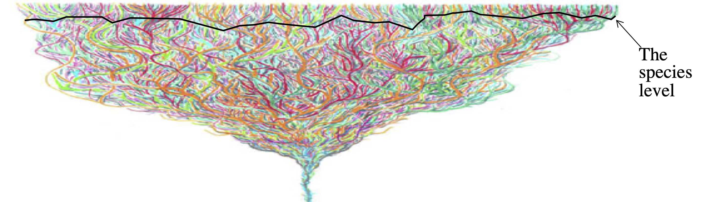
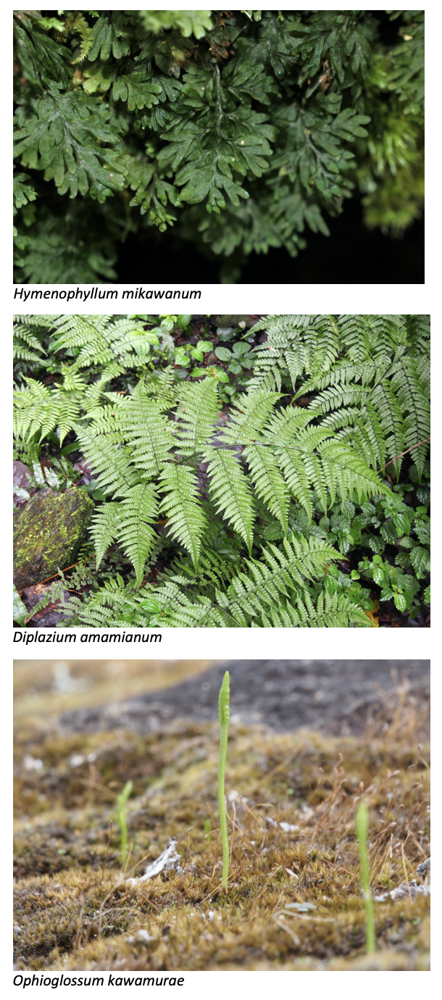
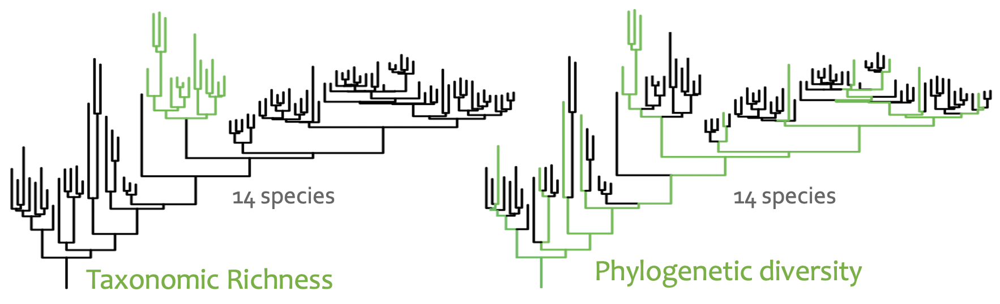
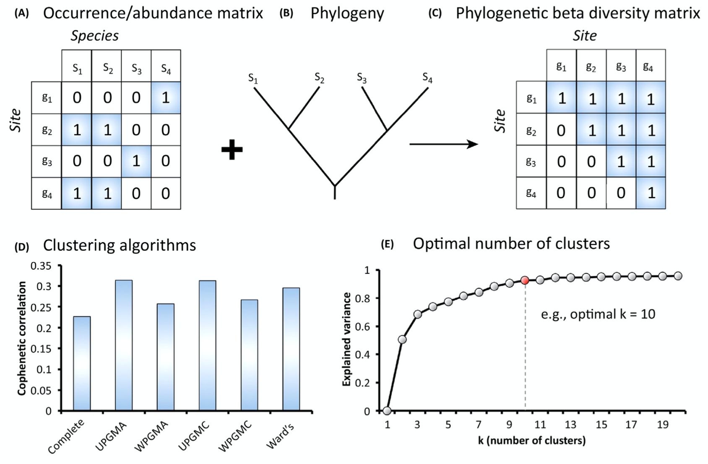
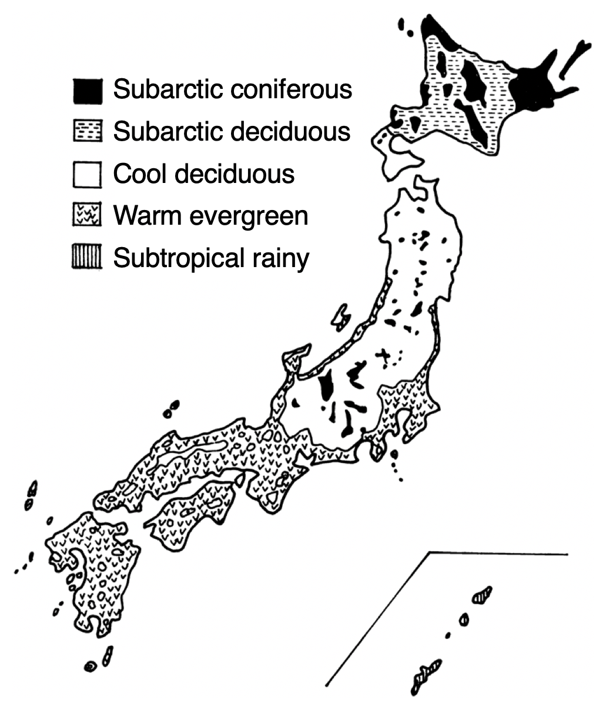
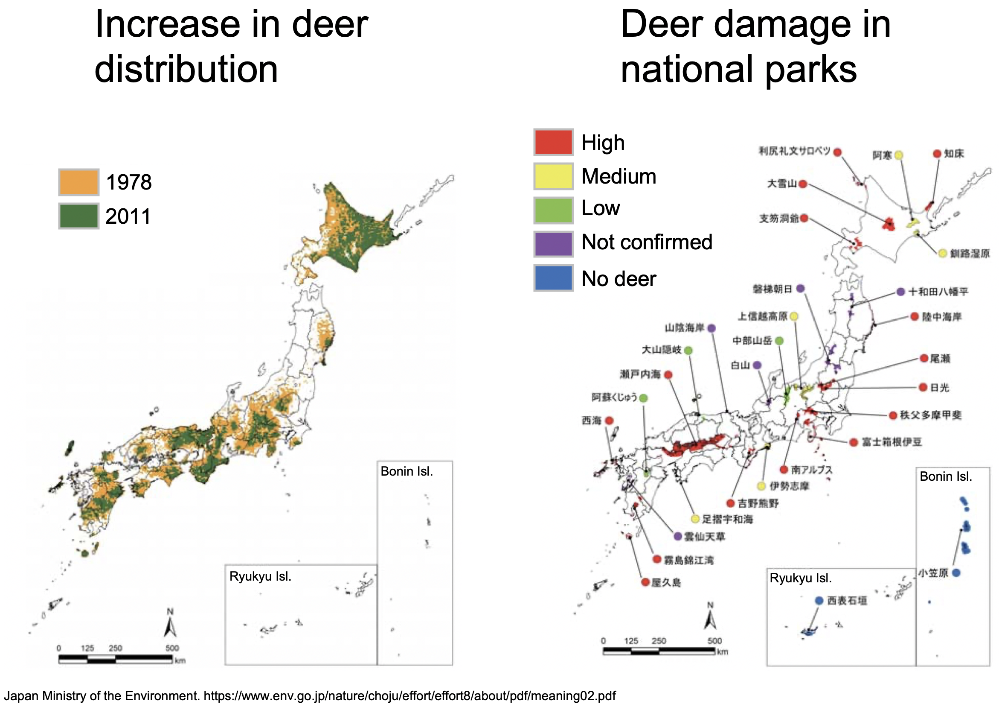
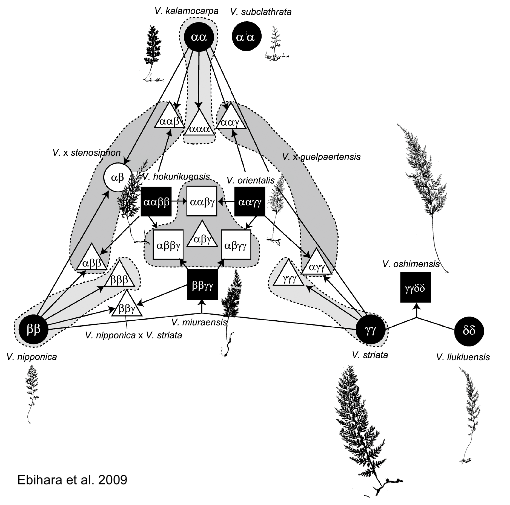
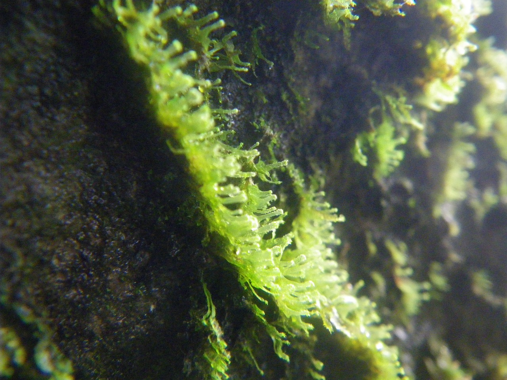

```{r setup, include=FALSE}
knitr::opts_chunk$set(echo = FALSE, warning = FALSE, message = FALSE, include = TRUE, eval = TRUE, cache = TRUE, dev = "svg", dev.args=list(bg="transparent"))
```

```{r load-packages-funcs, cache = FALSE}
library(conflicted)
library(magick)
library(ggtext)
library(drake)
library(knitr)
library(patchwork)
library(scales)
library(scico)
library(magrittr)
library(broom)
library(assertr)
library(sf)
library(rcartocolor)
library(tidyverse)

# Resolve conflicts
conflicted::conflict_prefer("map", "purrr")
conflicted::conflict_prefer("select", "dplyr")
conflicted::conflict_prefer("filter", "dplyr")
conflicted::conflict_prefer("gather", "tidyr")
conflicted::conflict_prefer("extract", "magrittr")

# Specify custom themes
simple_map_theme <- function () {
  theme(
    panel.grid.major = element_line(color = "white", size = 0.1),
    panel.background = element_rect(fill = "grey70"),
    legend.position = "none",
    axis.text = element_blank(),
    axis.ticks = element_blank()
  )
}

simple_map_theme_light <- function () {
  theme(
    panel.grid.major = element_line(color = "white", size = 0.1),
    panel.background = element_rect(fill = "grey90"),
    legend.position = "none",
    axis.text = element_blank(),
    axis.ticks = element_blank()
  )
}

trend_line_theme <- function () {
  theme(
    panel.background = element_blank(),
    panel.grid.major = element_line(size = 0.1, color = "dark grey"),
    panel.grid.minor = element_blank(),
    axis.title.y = element_blank(),
    axis.ticks.y = element_blank(),
    axis.ticks.x = element_blank(),
    axis.text.y = element_blank()
  )
}


map_theme_pp <- function() {
  theme(
    panel.grid.major = element_line(color = "white", size = 0.1),
    panel.background = element_rect(fill = "grey70"),
    axis.ticks = element_blank()
  )
}

map_theme_pp_light <- function() {
  theme(
    panel.grid.major = element_line(color = "white", size = 0.1),
    panel.background = element_rect(fill = "grey90"),
    axis.ticks = element_blank()
  )
}

source(here::here("R/functions.R"))
```

```{r, load-refs, includ = FALSE, cache = FALSE}
# Set bibliography options
library(RefManageR)
BibOptions(
  ignore.case = TRUE,
  check.entries = FALSE,
  max.names = 3,
  bib.style = "authoryear", # set style of bibliography as e.g., "Nitta 2020..."
  style = "text" # set style of citations as plain text (no links)
)

# Read in bibliography
bib <- ReadBib(here::here("presentations/bsa_2020-07-27/refs.bib"), check = FALSE)
```

```{r load-data, cache = FALSE}
# Set cache
ja_fern_cache <- new_cache(here::here("ja_fern_cache"))

# Load targets
loadd(list = c(
  "ses_div_ferns_spatial",
  "occ_point_data_ferns",
  "protected_areas",
  "traits_for_dist",
  "comm_ferns",
  "green_list",
  "ppgi"),
  cache = ja_fern_cache)

# Read in pteridophyte GBIF collections per country data from
# Iwasaki lab presentation
collections_by_country <- read_csv(here::here("data_raw/gbif_pterido_coll_by_country.csv")) %>%
  mutate(country = factor(country)) %>%
  mutate(country = fct_reorder(country, n))

# Download high-res map of Japan,
# crop to spatial div results area
japan <- rnaturalearth::ne_countries(country = "japan", scale = "large", returnclass = "sf") %>%
  sf::st_crop(sf::st_bbox(ses_div_ferns_spatial))

# Save currently used data as back-up in case data produced by plan changes
data <- list(
  ses_div_ferns_spatial = ses_div_ferns_spatial,
  occ_point_data_ferns = occ_point_data_ferns,
  protected_areas = protected_areas,
  traits_for_dist = traits_for_dist,
  comm_ferns = comm_ferns,
  green_list = green_list,
  ppgi = ppgi,
  collections_by_country = collections_by_country,
  japan = japan
)

saveRDS(data, here::here("presentations/bsa_2020-07-27/data/data.RDS"))

# Change phyloregion cluster to factor
ses_div_ferns_spatial <- ses_div_ferns_spatial %>%
  mutate(taxonomic_cluster = as.factor(taxonomic_cluster) %>% fct_infreq %>% as.numeric %>% as.factor) %>%
  mutate(phylo_cluster = as.factor(phylo_cluster) %>% fct_infreq %>% as.numeric %>% as.factor)
```

```{r title-slide-image, eval = FALSE}
# Code to make title slide image, don't need to run when rendering slides
title_theme <- theme_void() +
  theme(
    plot.title = element_blank(),
    plot.subtitle = element_blank(),
    legend.position = "none",
     panel.background = element_rect(fill = "black"),
    panel.grid.major = element_blank(),
    panel.grid.minor = element_blank(),
  )

# Change cluster to factor
ses_div_ferns_spatial <- ses_div_ferns_spatial %>%
  mutate(taxonomic_cluster = as.factor(taxonomic_cluster) %>% fct_infreq %>% as.numeric %>% as.factor) %>%
  mutate(phylo_cluster = as.factor(phylo_cluster) %>% fct_infreq %>% as.numeric %>% as.factor)


a <- ggplot(ses_div_ferns_spatial, aes(fill = richness)) +
  geom_sf(color = "transparent") +
  scale_fill_scico(palette = "lajolla") +
  title_theme

b <- ggplot(ses_div_ferns_spatial, aes(fill = rpd_obs_z)) +
  geom_sf(color = "transparent") +
  labs(fill = "SES RPD") +
  scale_fill_scico(
    palette = "roma",
    na.value="grey80",
    direction = -1,
    limits = c(
      -get_limit(ses_div_ferns_spatial, rpd_obs_z, "abs"),
      get_limit(ses_div_ferns_spatial, rpd_obs_z, "abs")
    )) +
  title_theme

c <- ggplot(ses_div_ferns_spatial, aes(fill = phylo_cluster)) +
  geom_sf(color = "transparent") +
  labs(fill = "Cluster") +
  scale_fill_carto_d(name = "Cluster", type = "qualitative", palette = "Bold") +
  title_theme

a + b + c + plot_layout(ncol = 1)

# Write out here, then crop manually
ggsave(
  plot = title_image, 
  filename = here::here("presentations/bsa_2020-07-27/images/title.png"),
  dpi = 300)
```

class: inverse, middle, title-slide, big-margin
background-color: #000000

.pull-left-wide[
# Exploring dimensions of biodiversity in Japanese ferns
<br>
## Joel H. Nitta<sup>1</sup>, Brent D. Misher<sup>2</sup>, Wataru Iwasaki<sup>1</sup>, Atsushi Ebihara<sup>3</sup>

<sup>1</sup>University of Tokyo, Japan<br>

<sup>2</sup>University of California, Berkeley, USA<br>

<sup>3</sup>National Museum of Nature and Science, Japan

<span style = 'font-size: 80%;'>https://joelnitta.com</span>
]

.pull-right-narrow[

]

---
class: big-margin

## Biodiversity: more than just counting species

Species richness is only one dimension of biodiversity!

We should also consider

- Phylogenetic diversity

- Functional diversity

- How these are related to each other



---
class: big-margin

## Biodiversity: more than just counting species

Species richness is only one dimension of biodiversity!

We should also consider

- Phylogenetic diversity

- Functional diversity

- How these are related to each other

**This requires comprehensive sampling of taxa, DNA, and traits**

---
class: big-margin

## Ferns of Japan: an ideal system for studying biodiversity

```{r count-taxa}
# count number of higher taxa (genera and families)
n_fern_taxa <-
green_list %>%
  mutate(genus = str_split(taxon, "_") %>% map_chr(1)) %>%
  assert(not_na, genus) %>%
  # Add higher-level taxonomy
  left_join(ppgi, by = "genus") %>%
  assert(not_na, class) %>%
  # Filter to only ferns
  filter(class == "Polypodiopsida") %>%
  summarize(
    n_genus = n_distinct(genus),
    n_family = n_distinct(family)
  )
```

.pull-left[

- Diverse flora

 - ca. 675 spp.

 - `r n_fern_taxa$n_genus` genera

 - `r n_fern_taxa$n_family` families

- One of the best-collected fern floras in the world

- Data available for DNA, distribution, and traits
]

.pull-right[
.center[

]
]

.footnote[.small[Photos: A. Ebihara]]

---
class: big-margin

## Ferns of Japan: an ideal system for studying biodiversity

.pull-left[

- Diverse flora

 - ca. 675 spp.

 - `r n_fern_taxa$n_genus` genera

 - `r n_fern_taxa$n_family` families

- One of the best-collected fern floras in the world

- Data available for DNA, distribution, and traits
]

.pull-right[
```{r gbif-colls-per-country}
# Plot showing top 10 pteridophyte collections in GBIF by country
ggplot(collections_by_country, aes(x = country, y = n)) +
  geom_col() +
  coord_flip() +
  labs(
    title = "GBIF pteridophyte \ncollections (top 10)",
    y = "No. collections") +
  scale_y_continuous(labels = scales::comma) +
  ggplot2::theme_bw(base_size = 24) +
  theme(
    axis.title.y = element_blank(),
    panel.grid.minor = ggplot2::element_blank(),
    panel.grid.major.y = ggplot2::element_blank(),
      axis.text.x = ggplot2::element_text(colour="black"),
      axis.text.y = ggplot2::element_text(colour="black")
  )
```
]

---
## A (very brief) introduction to the biogeography of Japan

.pull-left-narrow[
- Wide variation in climate from north (subarctic) to south (subtropical)

- Wide variation in elevation

- Tertiary relict flora (never glaciated)

- Main islands continental, southern islands oceanic
]

.pull-right-wide[

]

---
class: big-margin

## Goals of this study

Using the **ferns of Japan** as a study system, seek to understand:

1. How is biodiversity distributed? 
 
2. How is biodiversity structured? 
 
3. How well is biodiversity protected?

---
class: big-margin
## Data sources

```{r summarize-traits}
trait_summary <- make_trait_summary(traits_for_dist)

n_binary <- trait_summary %>% filter(trait_type == "binary") %>% nrow()
n_cont <- trait_summary %>% filter(trait_type == "continuous") %>% nrow()
n_qual <- trait_summary %>% filter(trait_type == "qualitative") %>% nrow()
```

**Occurrence data**

- Specimens at herbaria in Japan

- `r nrow(occ_point_data_ferns) %>% scales::number(big.mark = ",")` specimens (`r occ_point_data_ferns %>% pull(taxon) %>% n_distinct()` taxa)

- Convert to 0.2° (ca. 20 km x 20 km) presence-absence matrix

---
class: big-margin
## Data sources

**Phylogenetic tree**

- *rbcL* sequences from Japanese specimens `r AutoCite(bib, "Ebihara2019b")`

- Combine with broad sampling from GenBank

- Infer phylogeny with IQ-TREE (Nguyen et al., 2015) `r NoCite(bib, "Nguyen2015")`

- Date with 27 fossil calibration points `r AutoCite(bib, "Testo2016a")` using treePL `r AutoCite(bib, "Smith2012")`

- Subset to only Japanese taxa

---
class: big-margin

## Data sources

**Traits**

- `r nrow(trait_summary)` morphological traits mostly used for ID `r AutoCite(bib, "Ebihara2019b")`

  - `r n_binary` binary (e.g., false indusium)

  - `r n_cont` continuous (e.g., stipe length)

  - `r n_qual` qualitative (e.g., indusium shape, lamina texture)
  
---
class: middle, inverse, big-margin

# How is biodiversity distributed? 

---
## Species richness is humped-shaped

```{r centroids}
# Convert diversity metrics dataframe to centroids for plotting trends
ses_div_centroids <-
  ses_div_ferns_spatial %>%
  mutate(
    longitude = sf::st_centroid(geometry) %>% st_coordinates %>% magrittr::extract(,1),
    latitude = sf::st_centroid(geometry) %>% st_coordinates %>% magrittr::extract(,2)) %>%
  as_tibble %>%
  dplyr::select(-geometry)

# Get min and max latitude for setting common limits between
# maps and trendlines
ja_lat_min <- ses_div_centroids %>% pull(latitude) %>% min()
ja_lat_max <- ses_div_centroids %>% pull(latitude) %>% max()
```

```{r richness, out.width = "120%"}
# Fern richness
# - map
a <- ggplot(ses_div_ferns_spatial, aes(fill = richness)) +
  geom_sf(color = "transparent") +
  scale_fill_scico(palette = "lajolla") + 
  labs(fill = "No. taxa") +
  scale_y_continuous(labels = scales::label_number(suffix = "\u00b0N", accuracy = 1), limits = c(ja_lat_min, ja_lat_max)) +
  scale_x_continuous(labels = scales::label_number(suffix = "\u00b0E", accuracy = 1)) +
  map_theme_pp() +
  theme(
    legend.title = element_text(size = 20/.pt),
    legend.text = element_text(size = 16/.pt),
    legend.justification=c(0,1), legend.position=c(0,1)
  )
  

# - latitudinal trends
b <- ggplot(ses_div_centroids, aes(x = latitude, y = richness)) +
  geom_point(color = "grey50", shape = 1 ) +
  geom_smooth(se = FALSE) +
  xlim(ja_lat_min, ja_lat_max) +
  coord_flip() +
  labs(y = "No. taxa") +
  trend_line_theme()

a + b + plot_layout(widths = c(3,1), heights = c(1,1))
```

.footnote[Trendline: General additive model (GAM) with cubic splines]

---
class: big-margin
## Measuring diversity with a tree

.center[

]

<u>**P**</u>hylogenetic <u>**D**</u>iversity: Total unique branch length `r AutoCite(bib, "Faith1992")`

<u>**F**</u>unctional <u>**D**</u>iversity: PD, but measured with a trait dendrogram `r AutoCite(bib, "Petchey2002")`

---
## PD and FD are correlated with richness

```{r raw-div-1, out.width = "120%", fig.asp = 0.7}
# Richness
a <- ggplot(ses_div_ferns_spatial, aes(fill = richness)) +
  geom_sf(color = "transparent") +
  scale_fill_scico(palette = "lajolla") + 
  labs(title = "Taxonomic richness") +
  simple_map_theme()

b <- ggplot(ses_div_ferns_spatial, aes(fill = pd_obs)) +
  geom_sf(color = "transparent") +
  scale_fill_scico(palette = "lajolla") + 
  labs(
    title = "Phylogenetic diversity") +
  simple_map_theme()

c <- ggplot(ses_div_ferns_spatial, aes(fill = fd_obs)) +
  geom_sf(color = "transparent") +
  scale_fill_scico(palette = "lajolla") + 
  labs(
    title = "Functional diversity") +
  simple_map_theme()

a + b + c +
  plot_spacer() + plot_spacer() + plot_spacer() +
  plot_layout(nrow = 2, heights = c(0.5, 0.5))
```

---
## PD and FD are correlated with richness... as expected

```{r raw-div-2, out.width = "120%", fig.asp = 0.7}
# Richness
a <- ggplot(ses_div_ferns_spatial, aes(fill = richness)) +
  geom_sf(color = "transparent") +
  scale_fill_scico(palette = "lajolla") + 
  labs(title = "Taxonomic richness") +
  simple_map_theme()

b <- ggplot(ses_div_ferns_spatial, aes(fill = pd_obs)) +
  geom_sf(color = "transparent") +
  scale_fill_scico(palette = "lajolla") + 
  labs(
    title = "Phylogenetic diversity") +
  simple_map_theme()

c <- ggplot(ses_div_ferns_spatial, aes(fill = fd_obs)) +
  geom_sf(color = "transparent") +
  scale_fill_scico(palette = "lajolla") + 
  labs(
    title = "Functional diversity") +
  simple_map_theme()

d <- ggplot(ses_div_ferns_spatial, aes(x = richness, y = pd_obs)) +
  geom_point(shape = 1) +
  # Fit a logarithmic general additive model
  # https://stackoverflow.com/questions/40711980/r-ggplot2-fit-curve-to-scatter-plot
  geom_smooth(se = FALSE, method = "gam", formula = y ~ s(log(x)), size = 0.5) +
  labs(
    x = "No. taxa",
    y = "PD"
  ) +
  jntools::standard_theme()

e <- ggplot(ses_div_ferns_spatial, aes(x = richness, y = fd_obs)) +
  geom_point(shape = 1) +
  geom_smooth(se = FALSE, method = "gam", formula = y ~ s(log(x)), size = 0.5) +
  labs(
    x = "No. taxa",
    y = "FD"
  ) +
  jntools::standard_theme()

a + b + c +
  plot_spacer() + d + e +
  plot_layout(nrow = 2, heights = c(0.5, 0.5))
```

.footnote[Trendline: GAM with log-transform]
---
class: big-margin
## Compare raw values to random expectation with<br> <u>**S**</u>tandard <u>**E**</u>ffect <u>**S**</u>ize

.large[
.center[
$SES = \frac{obs - mean(null)}{sd(null)}$
]
]

SES = 0: not different from random

SES > 0: more diverse than expected

SES < 0: less diverse than expected

Null distribution: 999 communities randomized using "Independent Swap" (Gotelli, 2000)

---
## SES of PD is mostly clustered throughout

```{r ses-pd, out.width = "120%"}
# SES PD
# - map
a <- ggplot(ses_div_ferns_spatial, aes(fill = pd_obs_z)) +
  geom_sf(color = "transparent") +
  labs(fill = "SES PD") +
  scale_fill_scico(
    palette = "romaO",
    na.value="grey80",
    direction = -1,
    limits = c(
      -get_limit(ses_div_ferns_spatial, pd_obs_z, "abs"),
      get_limit(ses_div_ferns_spatial, pd_obs_z, "abs")
    )) +
  scale_y_continuous(labels = scales::label_number(suffix = "\u00b0N", accuracy = 1), limits = c(ja_lat_min, ja_lat_max)) +
  scale_x_continuous(labels = scales::label_number(suffix = "\u00b0E", accuracy = 1)) +
  map_theme_pp() +
  theme(
    legend.title = element_text(size = 20/.pt),
    legend.text = element_text(size = 16/.pt),
    legend.justification=c(0,1), legend.position=c(0,1)
  )

# - latitudinal trends
b <- ggplot(ses_div_centroids, aes(x = latitude, y = pd_obs_z)) +
  geom_point(color = "grey50", shape = 1 ) +
  geom_hline(yintercept = 0, linetype="dashed") +
  geom_smooth(se = FALSE) +
  xlim(ja_lat_min, ja_lat_max) +
  coord_flip() +
  labs(y = "SES PD") +
  trend_line_theme()

a + b + plot_layout(widths = c(3,1), heights = c(1,1))
```

.footnote[Trendline: GAM with cubic splines]
---
background-position: 40% 50%
background-image: url(images/RPD.png)
background-size: contain

## Compare branch lengths with <u>**R**</u>elative <u>**P**</u>hylogenetic <u>**D**</u>iversity

.pull-right[
Long branches

- Refugia

- Occurrence of a few members of clades that mainly occur outside of the study region

Short branches

- Recent speciation

.small[Mishler et al. (2014) `r NoCite(bib, "Mishler2014")`]
]

---
## RPD is high in the north and south

```{r ses-rpd, out.width = "120%"}
# SES RPD
# - map
a <- ggplot(ses_div_ferns_spatial, aes(fill = rpd_obs_z)) +
  geom_sf(color = "transparent") +
  labs(fill = "SES RPD") +
  scale_fill_scico(
    palette = "romaO",
    na.value="grey80",
    direction = -1,
    limits = c(
      -get_limit(ses_div_ferns_spatial, rpd_obs_z, "abs"),
      get_limit(ses_div_ferns_spatial, rpd_obs_z, "abs")
    )) +
  scale_y_continuous(labels = scales::label_number(suffix = "\u00b0N", accuracy = 1), limits = c(ja_lat_min, ja_lat_max)) +
  scale_x_continuous(labels = scales::label_number(suffix = "\u00b0E", accuracy = 1)) +
  map_theme_pp() +
  theme(
    legend.title = element_text(size = 20/.pt),
    legend.text = element_text(size = 16/.pt),
    legend.justification=c(0,1), legend.position=c(0,1)
  )

# - latitudinal trends
b <- ggplot(ses_div_centroids, aes(x = latitude, y = rpd_obs_z)) +
  geom_point(color = "grey50", shape = 1 ) +
  geom_hline(yintercept = 0, linetype="dashed") +
  geom_smooth(se = FALSE) +
  xlim(ja_lat_min, ja_lat_max) +
  coord_flip() +
  labs(y = "SES RPD") +
  trend_line_theme()

a + b + plot_layout(widths = c(3,1), heights = c(1,1))
```

.footnote[Trendline: GAM with cubic splines]
---
## Southern islands have high RFD

(RFD = functional analog of RPD)

```{r ses-rpd-rfd, out.width = "120%"}
# SES RPD
# - map
a <- ggplot(ses_div_ferns_spatial, aes(fill = rfd_obs_z)) +
  geom_sf(color = "transparent") +
  labs(fill = "SES RFD") +
  scale_fill_scico(
    palette = "romaO",
    na.value="grey80",
    direction = -1,
    limits = c(
      -get_limit(ses_div_ferns_spatial, rfd_obs_z, "abs"),
      get_limit(ses_div_ferns_spatial, rfd_obs_z, "abs")
    )) +
  scale_y_continuous(labels = scales::label_number(suffix = "\u00b0N", accuracy = 1), limits = c(ja_lat_min, ja_lat_max)) +
  scale_x_continuous(labels = scales::label_number(suffix = "\u00b0E", accuracy = 1)) +
  map_theme_pp() +
  theme(
    legend.title = element_text(size = 20/.pt),
    legend.text = element_text(size = 16/.pt),
    legend.justification=c(0,1), legend.position=c(0,1)
  )

# - latitudinal trends
b <- ggplot(ses_div_centroids, aes(x = latitude, y = rfd_obs_z)) +
  geom_point(color = "grey50", shape = 1 ) +
  geom_hline(yintercept = 0, linetype="dashed") +
  geom_smooth(se = FALSE) +
  xlim(ja_lat_min, ja_lat_max) +
  coord_flip() +
  labs(y = "SES RFD") +
  trend_line_theme()

a + b + plot_layout(widths = c(3,1), heights = c(1,1))
```

.footnote[Trendline: GAM with cubic splines]
---
## Southern islands are hotspots of endemism

Phylogenetic endemism = PD weighted by range size (Rosauer et al., 2009) `r NoCite(bib, "Rosauer2009")`

```{r pe, out.width = "120%"}
# PE
# - map
a <- ggplot(ses_div_ferns_spatial, aes(fill = pe_obs_p)) +
  geom_sf(color = "transparent") +
  scale_fill_scico(palette = "lajolla", labels = scales::percent) + 
  labs(fill = "PE percentile") +
  scale_y_continuous(labels = scales::label_number(suffix = "\u00b0N", accuracy = 1), limits = c(ja_lat_min, ja_lat_max)) +
  scale_x_continuous(labels = scales::label_number(suffix = "\u00b0E", accuracy = 1)) +
  map_theme_pp() +
  theme(
    legend.title = element_text(size = 20/.pt),
    legend.text = element_text(size = 16/.pt),
    legend.justification=c(0,1), legend.position=c(0,1)
  )

# - line tracking mean richness
b <- ggplot(ses_div_centroids, aes(x = latitude, y = pe_obs_p)) +
  geom_point(color = "grey50", shape = 1 ) +
  geom_hline(yintercept = 0.95, linetype="dashed") +
  geom_smooth(se = FALSE) +
  annotate("label", y = 0.95, x = ja_lat_max, label = "95%", size = 2) + 
  xlim(ja_lat_min, ja_lat_max) +
  scale_y_continuous(labels = scales::percent) +
  labs(y = "PE percentile") +
  coord_flip() +
  trend_line_theme()

a + b + plot_layout(widths = c(3,1), heights = c(1,1))
```

.footnote[Trendline: GAM with cubic splines]
---
class: middle, inverse, big-margin

# How is biodiversity structured? 

---
## Classify bioregions using clustering

.center[

]

(can also use taxonomic distances)

.footnote[`r Citet(bib, c("Daru2017", "Daru2020"))`]

---
## Most sites fall into four bioregions

```{r tax-bioregion, out.width = "120%", fig.asp = 0.6}
ggplot(ses_div_ferns_spatial, aes(fill = taxonomic_cluster)) +
  geom_sf(color = "transparent") +
  scale_fill_carto_d(name = "Region", type = "qualitative", palette = "Bold") +
  scale_y_continuous(labels = scales::label_number(suffix = "\u00b0N", accuracy = 1)) +
  scale_x_continuous(labels = scales::label_number(suffix = "\u00b0E", accuracy = 1)) +
  map_theme_pp_light() +
  labs(
    title = "Taxonomic bioregions"
  )
```

---
background-position: 50% 50%
background-image: url(images/species-background-1.png)
background-size: contain

## Most sites fall into four bioregions

```{r find-top-species}
# Extract clusters
clusters <-
  ses_div_ferns_spatial %>%
  as_tibble() %>%
  select(site = "grids", cluster = taxonomic_cluster, -geometry)

# Convert community df to long format
comm_ferns_long <-
  comm_ferns %>%
  rownames_to_column("site") %>%
  pivot_longer(names_to = "taxon", values_to = "abun", -site)

# Find top-scoring species (with high occurrence inside one cluster, and low elsewhere)
top_species <-
  comm_ferns_long %>%
  left_join(clusters, by = "site") %>%
  filter(cluster %in% 1:4) %>%
  group_by(taxon, cluster) %>%
  summarize(
    abun = sum(abun),
    total = n()
  ) %>%
  mutate(
    # percent abundance within a bioregion
    perc_abun = abun / total
  ) %>%
  arrange(taxon, desc(perc_abun)) %>%
  select(taxon, cluster, perc_abun) %>%
  group_by(taxon) %>%
  # take top two highest percent abundances per species, calculate their difference
  slice_max(n = 2, order_by = perc_abun, .preserve = TRUE, with_ties = FALSE) %>%
  mutate(
    top_cluster = cluster[perc_abun == max(perc_abun)]
  ) %>%
  summarize(
    max_dif = max(perc_abun) - min(perc_abun),
    cluster = unique(top_cluster)
  ) %>%
  # keep only those with greater than 65% difference between top 1st and 2nd 
  # most abundant bioregions
  filter(max_dif > 0.5) %>%
  group_by(cluster) %>%
  # Choose top three per cluster for plotting
  slice_max(n = 3, order_by = max_dif, with_ties = FALSE)
```

```{r plot-top-species-prep}
# make helper function to plot top-scoring species
plot_top_taxon <- function (taxon_select, ses_div_ferns_spatial, comm_ferns_long) {
ses_div_ferns_spatial %>%
  left_join(
    filter(comm_ferns_long, taxon == taxon_select),
    by = c(grids = "site")
  ) %>%
  mutate(abun = factor(abun)) %>%
  ggplot(aes(fill = abun)) +
  scale_fill_manual(values = c("#404040", "#d01c8b")) +
  geom_sf(color = "transparent") +
  labs(
    subtitle = str_replace_all(taxon_select, "_", " ")
  ) +
  simple_map_theme_light() +
  theme(
    plot.subtitle = element_text(face = "italic")
  )
}
```

```{r plot-top-species-cluster-1, out.width = "120%", fig.asp = 0.65}
focus_region <-
ses_div_ferns_spatial %>%
  mutate(focus = ifelse(taxonomic_cluster == 1, "yes", "no")) %>%
ggplot(aes(fill = taxonomic_cluster, alpha = focus)) +
  geom_sf(color = "transparent") +
  scale_fill_carto_d(name = "Cluster", type = "qualitative", palette = "Bold") +
  scale_alpha_manual(values = c(yes = 1, no = 0.25)) +
  scale_y_continuous(labels = scales::label_number(suffix = "\u00b0N", accuracy = 1)) +
  scale_x_continuous(labels = scales::label_number(suffix = "\u00b0E", accuracy = 1)) +
  simple_map_theme_light() +
  labs(subtitle = "Region 1")

focus_region +
plot_top_taxon(top_species$taxon[[1]], ses_div_ferns_spatial, comm_ferns_long) +
plot_top_taxon(top_species$taxon[[2]], ses_div_ferns_spatial, comm_ferns_long) +
plot_top_taxon(top_species$taxon[[3]], ses_div_ferns_spatial, comm_ferns_long) +
plot_layout(ncol = 2, nrow = 2)
```

.footnote[`r NoCite(bib, c("Ebihara2016b", "Ebihara2017"))`]

---
background-position: 50% 50%
background-image: url(images/species-background-2.png)
background-size: contain

## Most sites fall into four bioregions

```{r plot-top-species-cluster-2, out.width = "120%", fig.asp = 0.65}
focus_region <-
ses_div_ferns_spatial %>%
  mutate(focus = ifelse(taxonomic_cluster == 2, "yes", "no")) %>%
ggplot(aes(fill = taxonomic_cluster, alpha = focus)) +
  geom_sf(color = "transparent") +
  scale_fill_carto_d(name = "Cluster", type = "qualitative", palette = "Bold") +
  scale_alpha_manual(values = c(yes = 1, no = 0.25)) +
  scale_y_continuous(labels = scales::label_number(suffix = "\u00b0N", accuracy = 1)) +
  scale_x_continuous(labels = scales::label_number(suffix = "\u00b0E", accuracy = 1)) +
  simple_map_theme_light() +
  labs(subtitle = "Region 2")

focus_region +
plot_top_taxon(top_species$taxon[[4]], ses_div_ferns_spatial, comm_ferns_long) +
plot_top_taxon(top_species$taxon[[5]], ses_div_ferns_spatial, comm_ferns_long) +
plot_top_taxon(top_species$taxon[[6]], ses_div_ferns_spatial, comm_ferns_long) +
plot_layout(ncol = 2, nrow = 2)
```

.footnote[`r NoCite(bib, c("Ebihara2016b", "Ebihara2017"))`]

---
background-position: 50% 50%
background-image: url(images/species-background-3.png)
background-size: contain

## Most sites fall into four bioregions

```{r plot-top-species-cluster-3, out.width = "120%", fig.asp = 0.65}
focus_region <-
ses_div_ferns_spatial %>%
  mutate(focus = ifelse(taxonomic_cluster == 3, "yes", "no")) %>%
ggplot(aes(fill = taxonomic_cluster, alpha = focus)) +
  geom_sf(color = "transparent") +
  scale_fill_carto_d(name = "Cluster", type = "qualitative", palette = "Bold") +
  scale_alpha_manual(values = c(yes = 1, no = 0.25)) +
  scale_y_continuous(labels = scales::label_number(suffix = "\u00b0N", accuracy = 1)) +
  scale_x_continuous(labels = scales::label_number(suffix = "\u00b0E", accuracy = 1)) +
  simple_map_theme_light() +
  labs(subtitle = "Region 3")

focus_region +
plot_top_taxon(top_species$taxon[[7]], ses_div_ferns_spatial, comm_ferns_long) +
plot_top_taxon(top_species$taxon[[8]], ses_div_ferns_spatial, comm_ferns_long) +
plot_top_taxon(top_species$taxon[[9]], ses_div_ferns_spatial, comm_ferns_long) +
plot_layout(ncol = 2, nrow = 2)
```

.footnote[`r NoCite(bib, c("Ebihara2016b", "Ebihara2017"))`]

---
background-position: 50% 50%
background-image: url(images/species-background-4.png)
background-size: contain

## Most sites fall into four bioregions

```{r plot-top-species-cluster-4, out.width = "120%", fig.asp = 0.65}
bonin_box <-
ses_div_ferns_spatial %>%
  filter(taxonomic_cluster == 4) %>%
  sf::st_bbox()

expand_value <- 0.4

focus_region <-
ses_div_ferns_spatial %>%
  mutate(focus = ifelse(taxonomic_cluster == 4, "yes", "no")) %>%
ggplot(aes(fill = taxonomic_cluster, alpha = focus)) +
  geom_sf(color = "transparent") +
  scale_fill_carto_d(name = "Cluster", type = "qualitative", palette = "Bold") +
  scale_alpha_manual(values = c(yes = 1, no = 0.25)) +
  scale_y_continuous(labels = scales::label_number(suffix = "\u00b0N", accuracy = 1)) +
  scale_x_continuous(labels = scales::label_number(suffix = "\u00b0E", accuracy = 1)) +
  simple_map_theme_light() +
  labs(subtitle = "Region 4") +
  annotate(
    "rect", 
           xmin = bonin_box[["xmin"]] - expand_value, 
           xmax = bonin_box[["xmax"]] + expand_value, 
           ymin = bonin_box[["ymin"]] - expand_value, 
           ymax = bonin_box[["ymax"]] + expand_value,
    fill = "transparent",
    color = "grey10")

focus_region +
plot_top_taxon(top_species$taxon[[10]], ses_div_ferns_spatial, comm_ferns_long) +
plot_top_taxon(top_species$taxon[[12]], ses_div_ferns_spatial, comm_ferns_long) +
plot_top_taxon(top_species$taxon[[11]], ses_div_ferns_spatial, comm_ferns_long) +
plot_layout(ncol = 2, nrow = 2)
```

.footnote[`r NoCite(bib, c("Ebihara2016b", "Ebihara2017"))`]

---
## Taxonomic and phylogenetic bioregions are similar

```{r compare-bioregion, out.width = "120%", fig.asp = 0.65}
a <- ggplot(ses_div_ferns_spatial, aes(fill = taxonomic_cluster)) +
  geom_sf(color = "transparent") +
  scale_fill_carto_d(name = "Cluster", type = "qualitative", palette = "Bold") +
  scale_y_continuous(labels = scales::label_number(suffix = "\u00b0N", accuracy = 1)) +
  scale_x_continuous(labels = scales::label_number(suffix = "\u00b0E", accuracy = 1)) +
  map_theme_pp_light() +
  labs(
    title = "Taxonomic bioregions"
  ) +
  theme(legend.position = "none")

# (If needed)
# Swap first two colors to get them to match between taxonomic and phylogenetic plots
# cols_old <- rcartocolor::carto_pal(n = 8,  "Bold")
# cols <- cols_old
# cols[1] <- cols_old[2]
# cols[2] <- cols_old[1]

b <- ggplot(ses_div_ferns_spatial, aes(fill = phylo_cluster)) +
  geom_sf(color = "transparent") +
  # scale_fill_manual(values = cols) +
  scale_fill_carto_d(name = "Cluster", type = "qualitative", palette = "Bold") +
  scale_y_continuous(labels = scales::label_number(suffix = "\u00b0N", accuracy = 1)) +
  scale_x_continuous(labels = scales::label_number(suffix = "\u00b0E", accuracy = 1)) +
  labs(title = "Phylogenetic bioregions") +
  map_theme_pp_light() +
  theme(
    axis.text.y = element_blank(),
    legend.position = "none")

a + b 
```

---
## Bioregions mostly match traditionally-defined forest types

.pull-left[
Taxonomic bioregions

```{r tax-bioregion-forest}
ggplot(ses_div_ferns_spatial, aes(fill = taxonomic_cluster)) +
  geom_sf(color = "transparent") +
  scale_fill_carto_d(name = "Cluster", type = "qualitative", palette = "Bold") +
  scale_y_continuous(labels = scales::label_number(suffix = "\u00b0N", accuracy = 1)) +
  scale_x_continuous(labels = scales::label_number(suffix = "\u00b0E", accuracy = 1)) +
  map_theme_pp_light() +
  theme(legend.position = "none")
```
]

.pull-right[
Forest types<br>
.small[`r Citet(bib, "Shimizu2014")`<br><br>]

]

---
class: middle, inverse, big-margin

# How well is biodiversity protected? 

---
## Japan is well-protected overall (ca. 30% coverage)

```{r protected-areas, out.width = "120%", fig.asp = 0.65, dev="png", dpi=200}
japan_box <- sf::st_bbox(ses_div_ferns_spatial)

status_labels <-
protected_areas %>%
  as_tibble %>%
  dplyr::select(status, area) %>%
  group_by(status) %>%
  summarize(
    area = sum(area),
    .groups = "drop"
  ) %>%
  mutate(
    area = as.numeric(area),
    area_chr = area %>% round %>% scales::number(big.mark = ","),
    area_percent = area %>% magrittr::divide_by(377900) %>% scales::percent(),
    label = glue::glue("{str_to_sentence(status)} ({area_percent})") %>% set_names(status)
) %>%
  pull(label)

ggplot() +
  geom_sf(data = japan) +
  geom_sf(data = protected_areas, aes(fill = status), color = "transparent") +
  coord_sf(xlim = c(japan_box$xmin, japan_box$xmax), ylim = c(japan_box$ymin, japan_box$ymax)) +
  labs(
    fill = "Conservation\nstatus"
  ) +
  scale_fill_viridis_d(breaks = names(status_labels), labels = status_labels) +
  theme(
    axis.ticks = element_blank()
  )
```

---
## Hotspots of taxonomic richness are well-protected

```{r protected-richness, out.width = "120%", fig.asp = 0.7}
# Subset to the top 5% for richness
top_richness <-
  ses_div_ferns_spatial %>%
  mutate(rich_quant = ntile(richness, 20)) %>%
  filter(rich_quant == 20)
  
# Join with protected areas data
st_crs(top_richness) <- st_crs(protected_areas)

protected_richness <- st_join(top_richness, protected_areas) %>%
  filter(str_detect(rownames(.), "\\.", negate = TRUE))

# Make an inset showing area plotted in Japan
richness_box <- st_bbox(top_richness)

inset <- 
  ggplot() +
  geom_sf(data = japan) +
  annotate(
    "rect",
    xmin = richness_box$xmin,
    xmax = richness_box$xmax,
    ymin = richness_box$ymin,
    ymax = richness_box$ymax,
    alpha = .2) +
  theme_void() +
  theme(
    plot.background = element_rect(fill = "white", color = "transparent")
  )

# Crop japan background map to richness area
japan_cropped_to_richness <- japan
st_crs(japan_cropped_to_richness) <- st_crs(protected_richness)
japan_cropped_to_richness <- sf::st_crop(japan_cropped_to_richness, sf::st_bbox(protected_richness))

# plot showing protected status of high richness areas
richness_initial_plot <- ggplot() +
  geom_sf(data = japan_cropped_to_richness) +
  geom_sf(data = protected_richness, aes(fill = status)) + 
  scale_fill_viridis_d(breaks = c("low", "medium", "high"), labels = c("Low", "Medium", "High")) +
  labs(
    title = "Top 5% richness",
    fill = "Conservation\nstatus"
  ) +
  theme(
    axis.ticks = element_blank()
  )

# final plot: add inset
cowplot::ggdraw(richness_initial_plot) +
  cowplot::draw_plot(inset, 0.8, 0.45, .30, .30, hjust = 1, vjust = 1) 
```

---
## Hotspots of phylogenetic endemism are also well-protected

```{r protected-pe, out.width = "120%", fig.asp = 0.7}
# Subset to top 5% (vs. null) for PE
sig_pe <-
  ses_div_ferns_spatial %>%
  filter(pe_obs_p > 0.95)

# Join with protected areas data
# this joins raster (PE) with polygon (protected area)
# if they intersect. So it is a minimum estimation - we will
# count a grid cell as 'protected' if it intersects any part of
# a protected polygon.
st_crs(sig_pe) <- st_crs(protected_areas)

protected_pe <- st_join(sig_pe, protected_areas)

protected_pe <-
  protected_pe %>%
  filter(str_detect(rownames(.), "\\.", negate = TRUE))

# Make an inset showing area plotted in Japan
pe_box <- st_bbox(sig_pe)

inset <- 
  ggplot() +
  geom_sf(data = japan) +
  annotate(
    "rect",
    xmin = pe_box$xmin,
    xmax = pe_box$xmax,
    ymin = pe_box$ymin,
    ymax = pe_box$ymax,
    alpha = .2) +
  theme_void() +
  theme(
    plot.background = element_rect(fill = "white", color = "transparent")
  )

# Crop japan background map to PE area
japan_cropped_to_pe <- japan
st_crs(japan_cropped_to_pe) <- st_crs(protected_pe)
japan_cropped_to_pe <- sf::st_crop(japan_cropped_to_pe, sf::st_bbox(protected_pe))

# plot showing protected status of high PE areas
pe_initial_plot <- ggplot() +
  geom_sf(data = japan_cropped_to_pe) +
  geom_sf(data = protected_pe, aes(fill = status)) + 
  scale_fill_viridis_d(breaks = c("low", "medium", "high"), labels = c("Low", "Medium", "High"), na.value = "white") +
  labs(
    title = "Significantly high PE",
    fill = "Conservation\nstatus"
  ) +
  theme(
    axis.ticks = element_blank()
  )

# final plot: add inset
cowplot::ggdraw(pe_initial_plot) +
  cowplot::draw_plot(inset, 0.06, 0.47, .2, .2, hjust = 0, vjust = 0) 
```

---
class: big-margin
## A growing threat: herbivory by deer (*Cervus nippon*)

.center[

]

---
class: big-margin
## A growing threat: herbivory by deer (*Cervus nippon*)


.center[

]

---
class: big-margin

# Conclusions

- How is biodiversity distributed? 

- How is biodiversity structured?

- How well is biodiversity protected?

---
class: big-margin

# Conclusions

```{r conclusions-plots}
a <- ggplot(ses_div_ferns_spatial, aes(fill = richness)) +
  geom_sf(color = "transparent") +
  scale_fill_scico(palette = "lajolla") +
  labs(subtitle = "Richness") +
  simple_map_theme()

b <- ggplot(ses_div_ferns_spatial, aes(fill = rpd_obs_z)) +
  geom_sf(color = "transparent") +
  scale_fill_scico(
    palette = "romaO",
    na.value="grey80",
    direction = -1,
    limits = c(
      -get_limit(ses_div_ferns_spatial, rpd_obs_z, "abs"),
      get_limit(ses_div_ferns_spatial, rpd_obs_z, "abs")
    )) +
  labs(subtitle = "RPD") +
  simple_map_theme()

c <- ggplot(ses_div_ferns_spatial, aes(fill = taxonomic_cluster)) +
  geom_sf(color = "transparent") +
  labs(subtitle = "Taxonomic bioregions") +
  scale_fill_carto_d(name = "Cluster", type = "qualitative", palette = "Bold") +
  simple_map_theme()
```

.pull-left[
How is biodiversity distributed? 

- Taxonomic diversity highest in Kyushu

- Phylogenetic and functional diversity, phylogenetic endemism highest in southern islands
]

.pull-right[
```{r conclusions-richness, out.width="450px"}
a <- ggplot(ses_div_ferns_spatial, aes(fill = richness)) +
  geom_sf(color = "transparent") +
  scale_fill_scico(palette = "lajolla") +
  labs(title = "Richness") +
  simple_map_theme() +
  theme(
    plot.title = element_text(size = 18)
  )

b <- ggplot(ses_div_ferns_spatial, aes(fill = rpd_obs_z)) +
  geom_sf(color = "transparent") +
  scale_fill_scico(
    palette = "romaO",
    na.value="grey80",
    direction = -1,
    limits = c(
      -get_limit(ses_div_ferns_spatial, rpd_obs_z, "abs"),
      get_limit(ses_div_ferns_spatial, rpd_obs_z, "abs")
    )) +
  labs(title = "RPD") +
  simple_map_theme() +
  theme(
    plot.title = element_text(size = 18)
  )

a + b + plot_layout(ncol = 1)
```
]

---
class: big-margin

# Conclusions

.pull-left[
How is biodiversity structured?

- Into four major clusters that track major forest types
]

.pull-right[
```{r conclusions-regions}
ggplot(ses_div_ferns_spatial, aes(fill = taxonomic_cluster)) +
  geom_sf(color = "transparent") +
  labs(title = "Taxonomic bioregions") +
  scale_fill_carto_d(name = "Cluster", type = "qualitative", palette = "Bold") +
  simple_map_theme_light() +
  theme(
    plot.title = element_text(size = 18)
  )
```
]

---
class: big-margin

# Conclusions
.pull-left[
How well is biodiversity protected?

- Well-protected in terms of status

- May be in danger due to herbivory by deer
]

.pull-right[
```{r conclusions-protection}
 ggplot() +
  geom_sf(data = japan_cropped_to_richness) +
  geom_sf(data = protected_richness, aes(fill = status)) + 
  scale_fill_viridis_d(breaks = c("low", "medium", "high"), labels = c("Low", "Medium", "High")) +
  labs(title = "Top 5% richness hotspots", fill = "Conservation\nstatus"
  ) +
  theme(
    axis.text = element_blank(),
    axis.ticks = element_blank(),
    plot.title = element_text(size = 18)
  )
```
]
 
---
# Future directions

.pull-left[
<br>
- Understand the role that hybridization has on diversification <br> (ca. 300 described hybrids!) `r NoCite(bib, "Ebihara2009")`

<br>
<br><br>
<br>
- Clarify the role of fern gametophytes in community assembly at broad scales
]

.pull-right[


<br>.tiny[Photo: Joel Nitta]
]

---
class:: big-margin

# Acknowledgements

.center[


Members of the Iwasaki Lab (The University of Tokyo)

Eric Schuettpelz (Smithsonian Institution)

Alexander White (Smithsonian Institution)
]

---
## References

.small[
```{r, results='asis', echo = FALSE, warning = FALSE, cache = FALSE}
PrintBibliography(bib, start = 1, end = 8)
```
]

---
## References

.small[
```{r, results='asis', echo = FALSE, warning = FALSE, cache = FALSE}
PrintBibliography(bib, start = 9, end = 16)
```
]